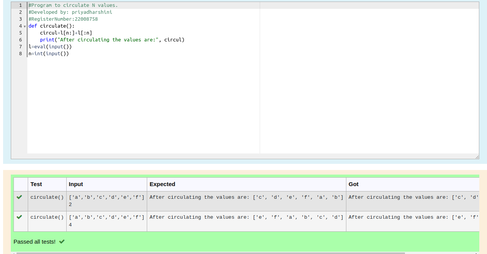

# Circulate-the-values-of-N-variables

## Aim:

To write a python program to circulate the n variables using function concept

## Equipment’s required:

PC
Anaconda - Python 3.7

## Algorithm: 

### Step 1: 
Write the given details
### Step 2: 
Define a function for circulating
### Step 3: 
Get the value from the user for the number of rotation
### Step 4: 
Using the slicing concept rotate the list
### Step 5: 
Call the function
### Step 6: 
End the program

## Program:
```python
#Program to circulate N values.
#Developed by: priyadharshini
#RegisterNumber:22008758
def circulate():
    circul=l[n:]+l[:n]
    print("After circulating the values are:", circul)
l=eval(input())
n=int(input())
```

## Output:


## Result:
Thus the circulating of two values are successfully executed
